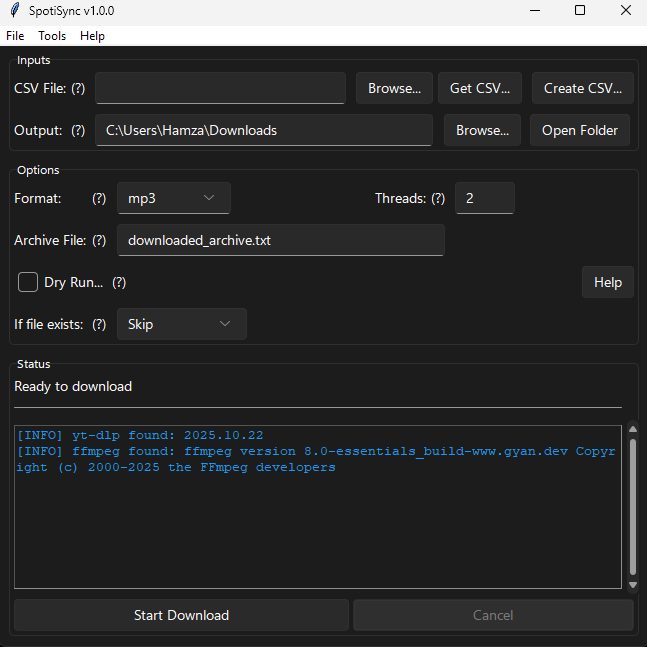

# 🎵 SpotiSync

A beautiful, user-friendly desktop application to download music from Spotify playlists using YouTube as the source.



## ✨ Features

- 🎨 **Modern Dark UI** - Clean, professional interface
- 📊 **Real-time Progress** - Live download statistics and progress tracking
- 🎯 **Smart CSV Parsing** - Auto-detects track information
- 🔄 **Multi-threaded Downloads** - Download multiple songs simultaneously
- 💾 **Settings Persistence** - Remembers your preferences
- 🎼 **Multiple Formats** - Support for MP3, M4A, WAV, OPUS, AAC
- 📁 **Archive System** - Prevents duplicate downloads
- ⚡ **Built-in Binaries** - No separate downloads needed (when built as EXE)

## 🚀 Quick Start (For Users)

### Download Pre-built EXE
1. Go to [Releases](https://github.com/Code-by-Hamza/SpotiSync/releases)
2. Download `SpotiSync.exe`
3. Run the executable - no installation required!

### First Time Setup
1. Click **"Get CSV..."** to export your Spotify playlist from Exportify
2. Select the downloaded CSV file
3. Choose your output folder
4. Click **"Start Download"**

That's it! 🎉

## 🛠️ For Developers

### Prerequisites
- Python 3.8+
- Windows (for building EXE)

### Installation

1. **Clone the repository**
   ```bash
   git clone https://github.com/Code-by-Hamza/SpotiSync.git
   cd SpotiSync
   ```

2. **Install dependencies**
   ```bash
   pip install -r requirements.txt
   ```

3. **Download binaries** (required for running)
   - Download [yt-dlp.exe](https://github.com/yt-dlp/yt-dlp/releases)
   - Download [ffmpeg.exe](https://github.com/BtbN/FFmpeg-Builds/releases)
   - Place both in the project root directory

### Running from Source

```bash
python SpotiSync.py
```

### Building the EXE

**Option 1: Using PowerShell Script (Recommended)**
```powershell
.\build.ps1
```

**Option 2: Manual Build**
```bash
pyinstaller SpotiSync.spec
```

The executable will be in `dist\SpotiSync.exe`

## 📋 Project Structure

```
SpotiSync/
├── SpotiSync.py           # Main application
├── SpotiSync.spec         # PyInstaller configuration
├── build.ps1              # Build script
├── requirements.txt       # Python dependencies
├── README.md              # This file
├── QUICKSTART.md          # User guide
├── BUILD_GUIDE.md         # Developer build instructions
├── .gitignore             # Git ignore rules
└── screenshot.png         # screenshots
```

## 🔧 Configuration

Settings are automatically saved to:
- **Windows**: `%APPDATA%\SpotiSync\settings.json`
- **Portable Mode**: `settings.json` (next to executable)

## 🐛 Troubleshooting

### "yt-dlp not found"
- Ensure `yt-dlp.exe` is in the same folder as the app
- Or install globally: `pip install yt-dlp`

### "ffmpeg not found"
- Download from [ffmpeg.org](https://ffmpeg.org/download.html)
- Place `ffmpeg.exe` next to the app

### CSV parsing errors
- Ensure your CSV has a "Track Name" column
- Try the built-in "Create CSV..." option

## 📝 License

MIT License - see [LICENSE](LICENSE) file for details

## 🙏 Credits

- [yt-dlp](https://github.com/yt-dlp/yt-dlp) - Download engine
- [FFmpeg](https://ffmpeg.org/) - Audio conversion
- [sv-ttk](https://github.com/rdbende/Sun-Valley-ttk-theme) - Modern theme

## 📧 Contact

- GitHub: [Code-by-Hamza](https://github.com/Code-by-Hamza)
- Issues: [Report a bug](https://github.com/Code-by-Hamza/SpotiSync/issues)

## ⭐ Support

If you find this useful, please give it a star! ⭐

---

Made with ❤️ by Code-by-Hamza